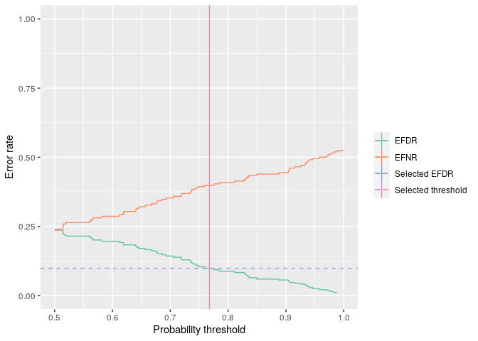

<!-- README.md is generated from README.Rmd. Please edit that file -->

bayefdr
=======

<!-- badges: start -->

<!-- badges: end -->

The goal of bayefdr is to provide tools for the estimation and
optimisation of Bayesian expected false discovery and expected false
negative rates.

Installation
------------

You can install the released version of bayefdr from
[CRAN](https://CRAN.R-project.org) with:

    install.packages("bayefdr")
    devtools::install_github("bayefdr")

Usage
-----

The main functions in this package are `efdr`, `efnr` and `efdr_search`.
`efdr` and `efnr` calculate the EFDR or EFNR for a vector of
probabilities given a specified probability threshold. `efdr_search`
finds the probability threshold that matches a target EFDR as closely as
possible. The basic input to this function is a vector of probabilities
and a target EFDR.

    library("bayefdr")
    probs <- runif(100)
    efdr(0.7, probs)
    #> [1] 0.1429126
    efnr(0.7, probs)
    #> [1] 0.3531349
    efdr <- efdr_search(probs, target_efdr = 0.1)
    efdr
    #> An object of class 'bayefdr'.
    #>  Optimal threshold: 0.768 EFDR: 0.0985 EFNR: 0.399

The output of this function is a `data.frame` with some extra
attributes. There is a plot method too.

    head(efdr)
    #>   threshold     EFDR      EFNR
    #> 1   0.50000 0.239581 0.2361073
    #> 2   0.50025 0.239581 0.2361073
    #> 3   0.50050 0.239581 0.2361073
    #> 4   0.50075 0.239581 0.2361073
    #> 5   0.50100 0.239581 0.2361073
    #> 6   0.50125 0.239581 0.2361073
    plot(efdr)

